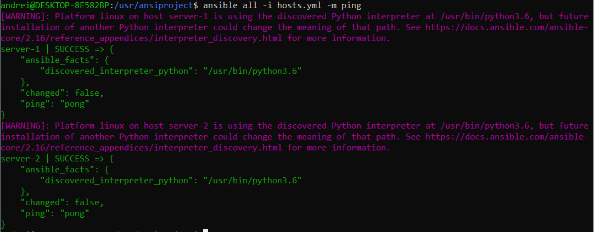

# Ansible-workout
Project describes how to Configure configure system on windows and configure ansible to execute module ping to check connection client-server 


### Item list

Install:
- [Install WSL2 + Ubuntu](#WSL2_Ububtu)
- [GUI for WSL (Optional)](#gui_wsl) 
- [SetUp Docker](#docker) 
- [Run servers on Docker](#docker_run_srv) 
- [Ansible install](#Ansible_install)
- [Ansible connect to the server setup](#Ansible_connect)


### <a name="WSL2_Ububtu"> WSL2 + Ubuntu</a>  

Use commands in PowerShell (hereinafter - PSh), from the admin, to enable wsl2:

`Enable-WindowsOptionalFeature -Online -FeatureName Microsoft-Windows-Subsystem-Linux`

`Enable-WindowsOptionalFeature -Online -FeatureName VirtualMachinePlatform`

Download wsl core from https://wslstorestorage.blob.core.windows.net/wslblob/wsl_update_x64.msi

set the default version for Windows `wsl --set-default-version 2` from PSh

For download and install ubuntu use `wsl --install -d ubuntu-24.04` . Set up username and pwd after it launched 


### <a name="gui_wsl">GUI for WSL</a>

Here is described steps how to integrate VSCode with plugin to get an access to the WSL
installed unix system for visual representations of files and folders and operate with them more easily

Install VSCode. Go to the File - preferences - Extensions

Find the WSL extension from Microsoft

It contains instructions in the description.

After install you are able to open unix OS under VSCode (Open Folder - choose root on WSL)


### <a name="docker">SetUp Docker</a>

In Ansible, to establish connection between the machines, we need to run at least two under our system. Docker could help us with that.

Check your unix system IP address 
`hostname -I`

Download and install Docker desktop (hereinafter - Dd) for your Windows.
Make sure that Dd use WSL 2 based engine in its preferences.

Install docker for unix, use command (-i to agree with all Q during installations):
`sudo apt install docker.io -y`

Check that it can pull and run images:
 `docker run hello-world`

and the additional IP address appears under the system, that related to the docker subnet
`hostname -I`


172.28.x.x: this is IP-address of the  WSL2 interface  in Windows system.

172.17.x.x: this is IP-address of the Docker. Docker create its own virtual network (bridge) for containers. By default all containers will get addresses like 172.17.0.2, 172.17.0.3 etc.


### <a name="docker_run_srv">Run servers on Docker</a> 

To create lightweight servers lets use docker to run them up

`docker run -d --name test-server-1 -p 2222:22 sickp/alpine-sshd`
`docker run -d --name test-server-2 -p 2223:22 sickp/alpine-sshd`

We have to install python on these containers because ansible will require python interpreter to manage remote systems.

Use shell on that containers to install python:

`docker exec -it test-server-1 /bin/sh` 

`apk update`

`apk add python3`

To find containers useful info, use command below:

`docker inspect <server-name>`


2) for the second container we will point to ansible to use a different interpreter (on wsl) 
all:
  hosts:
    hosts.yml
      server-2:
      .................
          ansible_python_interpreter: /usr/bin/python3

#### NOTE!
Containers can not use interpreter from Python, which is installed in WSL, as they working on isolated environment.


### <a name="Ansible_install">Ansible install</a>

From the wsl use next commands to install ansible:

 `sudo apt update`

`sudo apt-add-repository ppa:ansible/ansible`

`sudo apt install -y software-properties-common`

`sudo add-apt-repository -y -u ppa:ansible/ansible`

`sudo apt install ansible`

Check that ansible is installed by
`ansible --version`

Check the config file directory path. By default Ansible will but configuration uder /etc/ansible/ansible.cfg

We will disable keys check for SSH connection.
Open the file and make sure the parameter `host_key_checking` has `False` value


### <a name="Ansible_connect">Ansible connect to the server setup</a>

Next create your project directory, e.g. under /usr folder.

In that directory create file hosts.yml

It content should looks like

```
all:
    hosts:
      server-1:
        ansible_host: <OS_IP_ADDRESS>
        ansible_port: 2222
        ansible_connection: ssh
        ansible_user: root
        ansible_password: root
      server-2:
        ansible_host: <OS_IP_ADDRESS>
        ansible_port: 2223
        ansible_connection: ssh
        ansible_user: root
        ansible_password: root

```
- To get an IP Address of your system, check <a name="docker">SetUp Docker</a> section
- port forwarded we setUp on docker run ... command
- root is the default root username and pwd for alpine images

Run module ping for Ansible, to make sure that connection is established successfully to all hosts which we provided in appropriate file.

`ansible all -i hosts.yml -m ping`

As the final result you should see something like

that confirms connection was established

