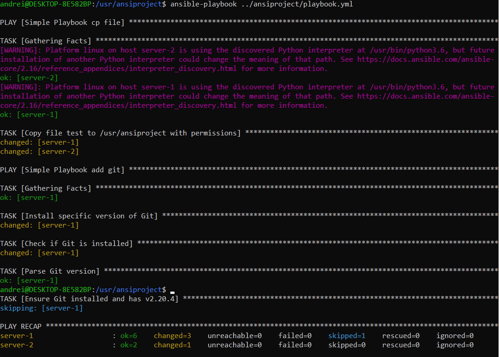

# Ansible-playbook-workout
Simple project that describes you how to create and run playbook with tasks for Ansible

Playbooks can:
- declare configurations

- orchestrate steps of any manual ordered process, on multiple sets of machines, in a defined order

- launch tasks synchronously or asynchronously

### Item list

- [Playbook intro](#playbook_1)
- [Prepare environment](#docker_ps) 
- [Create and execute tasks](#ans-pb_tasks) 
- [More info](#more_info) 


### <a name="playbook_1">Playbook intro</a>  
Ansible Playbooks offer a repeatable, reusable, simple configuration management and multi-machine deployment system, one that is well suited to deploying complex applications. If you need to execute a task with Ansible more than once, write a playbook and put it under source control. Then you can use the playbook to push out new configuration or confirm the configuration of remote systems.

Playbook consist from scenario (play) which execute in precedence order. Scenario is the task list for hosts group.

More details find in the 

### <a name="docker_ps">Prepare and run servers on docker</a>
To not run again docker image with ssh server and install python , let's create pre-configured docker image _workoutData/Dockerfile_

`docker build -f <path_to_the_dockerfile> -t pyssh:0.1 .`

Now you can run two servers from builded image:

`docker run -d --name test-server-1 -p 2222:22 pyssh:01`

`docker run -d --name test-server-2 -p 2223:22 pyssh:01`

Check that servers are running with ansible ping module `ansible all -i hosts.yml -m ping`

### <a name="ans-pb_tasks">Create and execute tasks</a>  
The simple playbook file could look like

```
# name of playbook
- name: Simple Playbook cp file 
# group of hosts that task will be applied to
  hosts: all
# keyword uses existing privilege escalation tools like sudo
  become: yes

  tasks: [List of the tasks]
..........................

```
All these info you will see after you execute it. 

The exact file with more tasks you can find in workoutData/2_ansiblePlaybook

Apply playbook with command:

`ansible-playbook <path_to_playbook>/playbook.yml`

The result should be like 

You can add a task that will fail if version of package is not compatible with specific one.
Use module fail for that:

```
    - name: Fail if Git version is not 2.120.0
      fail:
        msg: "Installed Git version is {{ installed_git_version }}. Required version is 2.120.0."
      when: installed_git_version is defined and installed_git_version != '2.120.4'
```
after apply that book you will see additional output that demonstrate our book was executed and 
not all the tasks was met expected result

TASK [Fail if Git version is not 2.120.0] ******************************************************************************
fatal: [server-1]: FAILED! => {"changed": false, "msg": "Installed Git version is 2.20.4. Required version is 2.120.0."}

PLAY RECAP *************************************************************************************************************
server-1                   : ok=6    changed=1    unreachable=0    failed=1    skipped=1    rescued=0    ignored=0
server-2                   : ok=2    changed=0    unreachable=0    failed=0    skipped=0    rescued=0    ignored=0

You can make sure and explore servers to find copied test file on both and installed git only on server-1.

### <a name="more_info">More about</a> 
[Ansible official documentation](https://docs.ansible.com/ansible/latest/playbook_guide/playbooks_intro.html)

[Ansible tests](https://docs.ansible.com/ansible/latest/playbook_guide/playbooks_tests.html#)

[Ansible modules](https://docs.ansible.com/ansible/latest/plugins/module.html)

[become](https://www.middlewareinventory.com/blog/ansible-sudo-ansible-become-example/)